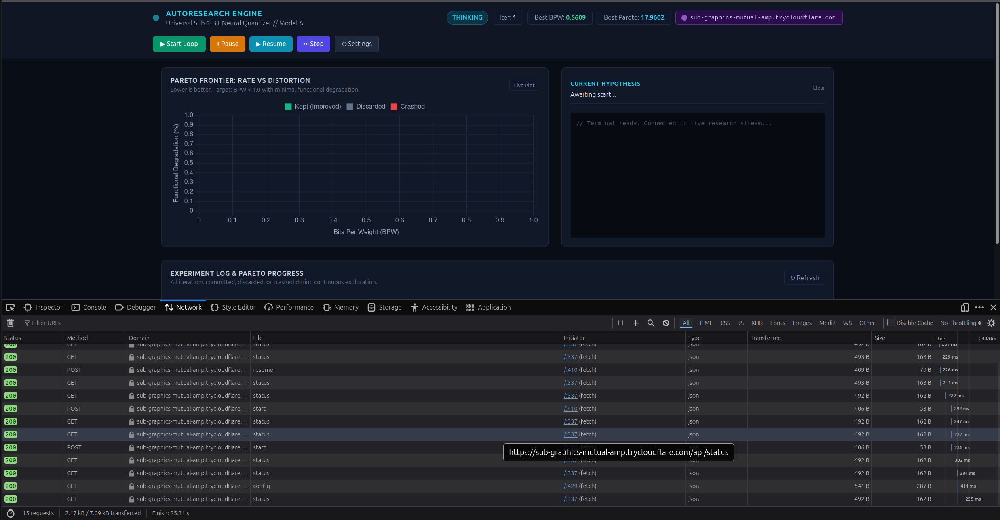
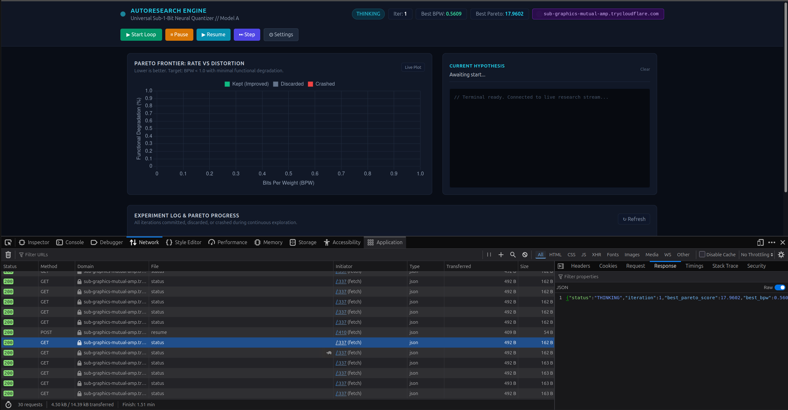
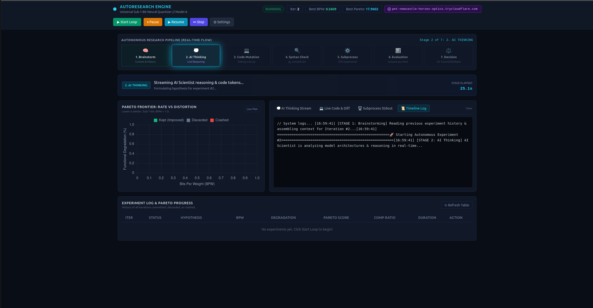
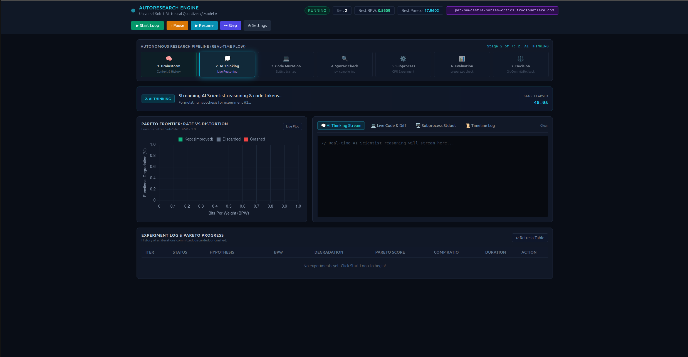
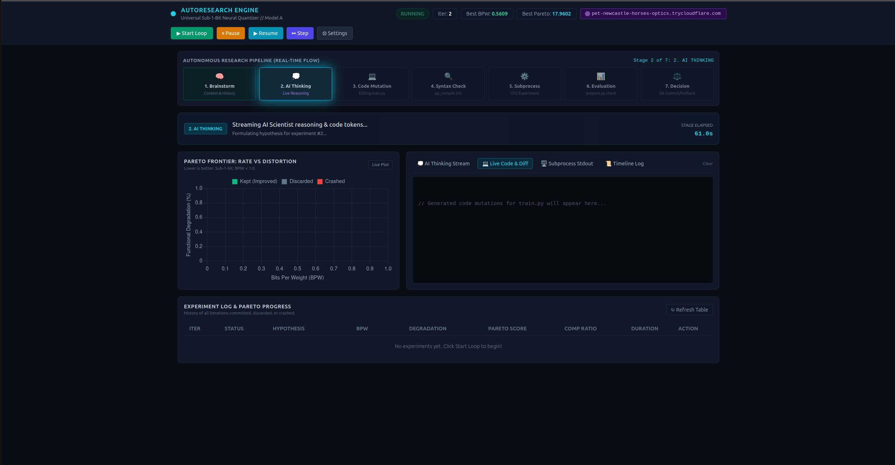
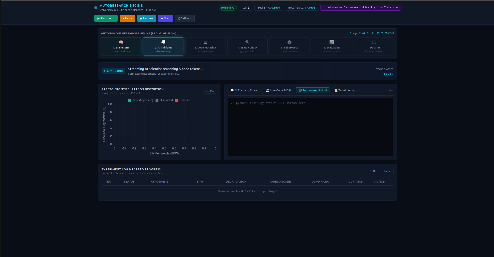
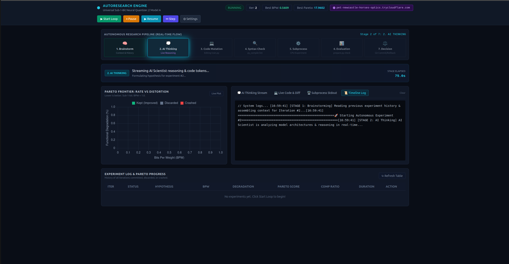
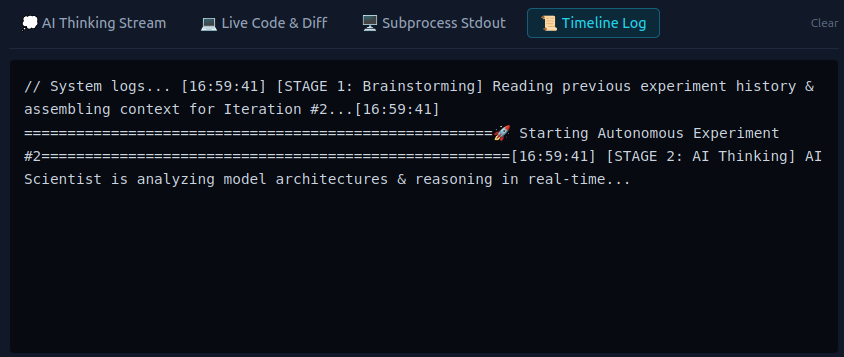

ini kenapa kok gini: 

kok nggak keliatan progress nya?
bahkan AI nya waktu thinking dan proses tool call apapun, kan mestinya keliatan
jadi intinya tujuannya itu buat supaya keliatan gitu flow nnya
ada viewn ya terus keliatan sekarang sampe mana, lagi ngapain

ini sekarang kayak gini: 
kok gini:  ,  ,  ,  , 
